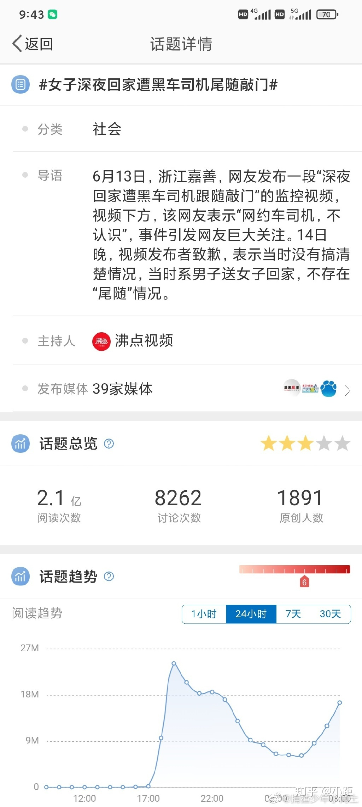
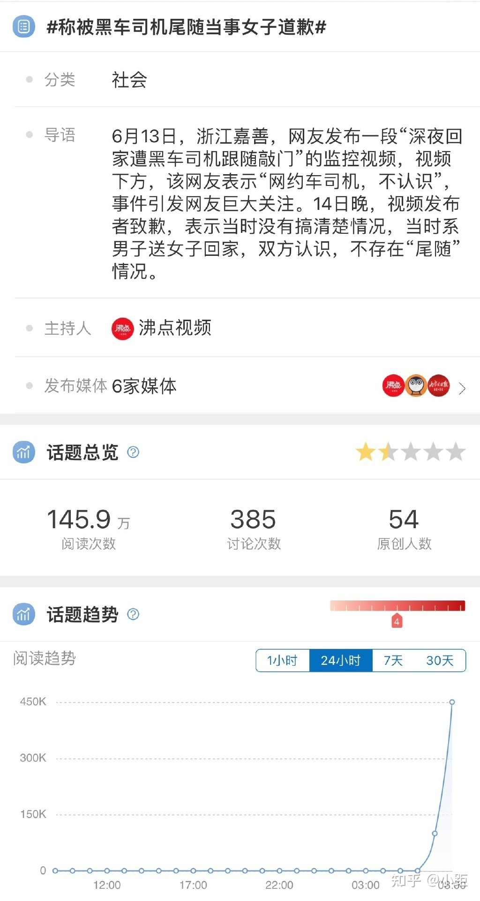

事情经过：[谷歌快照](https://webcache.googleusercontent.com/search?q=cache:3vPfKfLtD9IJ:https://weibo.com/1806128454/LxHfOuRK5) [存档](https://archive.is/wip/DB2Vm)

>【#黑车司机凌晨尾随女乘客回家# 大力敲门称“我是送你的哥哥[怒]】6月13日，浙江嘉兴，一女子凌晨3点多坐黑车回家，却被黑车司机尾随到家门口，女子下车后急忙上楼将门锁上，前脚进入单元，黑车司机后脚跟上来，并在女子家门口逗留、敲门，女子问其是谁，男子站在门口说是“送你回来的小哥哥”，男子在门口敲了好几声门不肯离开，女子在屋内告诉男子别敲了，男子抬头看到门口有摄像头，便逃之夭夭。#女子凌晨4点被黑车司机尾随到家#

事后证明，是谣言：[微博](https://weibo.com/5145725878/LxMR3vLSV) [存档](https://archive.is/wip/O5j2Z)

>【#称被黑车司机尾随当事女子道歉#：系误会】6月13日，浙江嘉善，网友发布一段“深夜回家遭黑车司机跟随敲门”的监控视频，视频下方，该网友表示“网约车司机，不认识”，事件引发网友巨大关注。14日晚，视频发布者致歉，表示当时没有搞清楚情况，当时系男子送女子回家，不存在“尾随”情况。#蓝v视界# 嘉兴·嘉善县 沸点视频的微博视频

但两者的舆论差距极大——从这里（[原文](https://www.zhihu.com/question/537740161/answer/2529524942)/[存档](https://archive.is/wip/CHRIi)）可以发现：

造谣热度如下：

辟谣热度如下：

不难得出结论，媒体只想渲染男性的负面新闻，并不想关注事实。