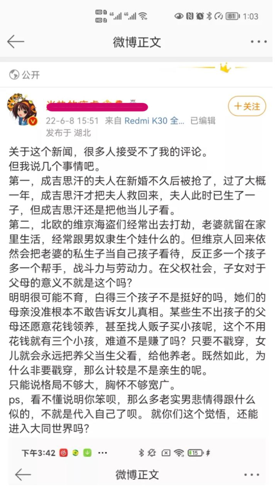
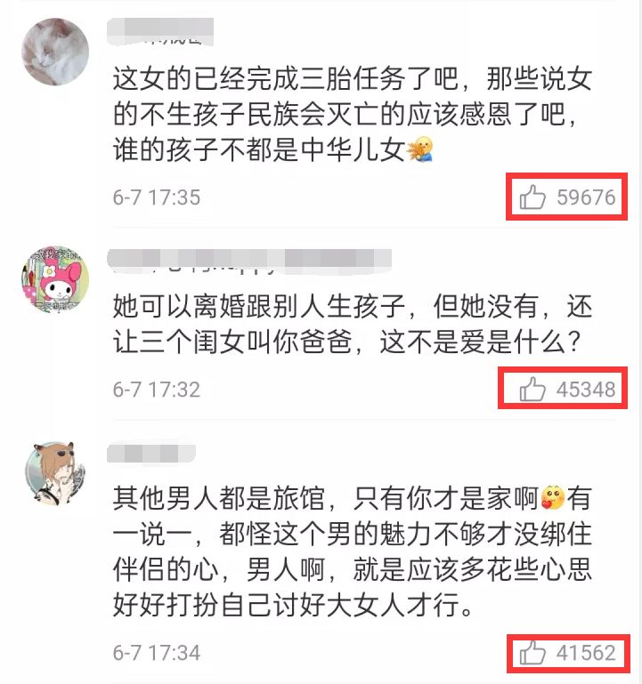

新闻报道：
1. [搜狐新闻](https://www.sohu.com/a/555234678_120388781) 存档：[archive](https://web.archive.org/web/20220609142126/https://www.sohu.com/a/555234678_120388781)
2.[HK 雅虎](https://hk.news.yahoo.com/%E6%B1%9F%E8%A5%BF%E7%94%B7%E5%AD%90%E7%B5%90%E5%A9%9A16%E5%B9%B4-dna%E6%8F%AD%E4%B8%89%E5%80%8B%E5%B0%8F%E5%AD%A9%E4%B8%A6%E9%9D%9E%E8%A6%AA%E7%94%9F-092900053.html) 存档：暂无

知乎链接：https://zhuanlan.zhihu.com/p/526637671 存档链接：暂无

截图如下：

